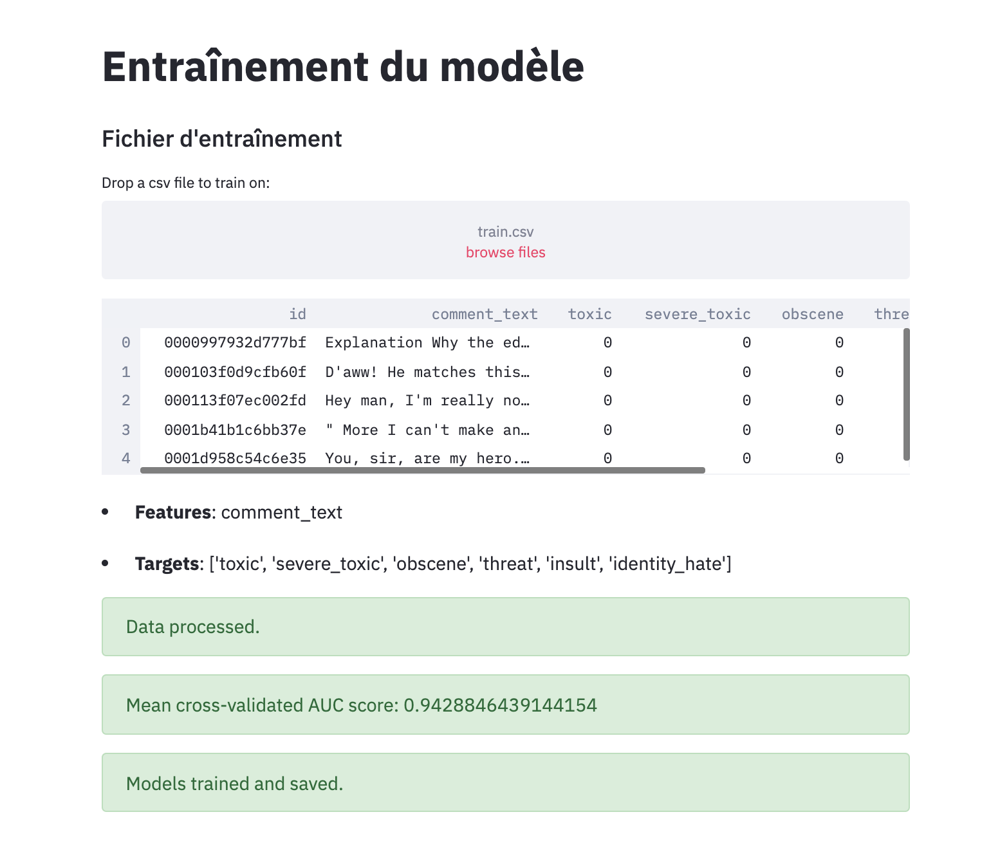

# demo_streamlit
Ce repository est une démonstration pour notre article de classification multilabel sur le blog d'OCTO Technology[OCTO Technology](https://lien_a_remplir)

## 1 - Création de l'environnement
L'environnement est géré par Conda. Pour créer l'environnement, utilisez la commande suivante :
```bash
conda create -n demo_multi_label python=3.7 -y
```

Puis activez l'environnement :
```bash
conda activate demo_multi_label
```

Enfin, installez les dépendances :
```bash
pip install -e .
```

## 2 - Lancez le dashboard de prédictions
Vous pouvez lancer le dashboard avec les modèles préentraînés sur le dataset [Toxic Comment](https://www.kaggle.com/c/jigsaw-toxic-comment-classification-challenge)
En exécutant la commande suivante, le dashboard sera lancé sur __localhost:8501__: 
```bash
streamlit run src/ui/streamlit_prediction.py
```


## 3 - [Optionnel] : Entraînez des modèles sur votre propre dataset
Il y a une deuxième web-app qui vous permettra d'entraîner les modèles sur votre propre dataset. Pour cela, le dataset doit être formaté de la même façon que le dataset Toxic Comment, à savoir qu'il doit avoir au moins une colonne de texte à utiliser comme feature et une ou plusieurs colonnes par label, indiquant si le texte appartient à ce label ou non.

Il faut ensuite modifier les variables dans **src/conf/global_variables** pour préciser les colonnes à prédire LABELS et la colonne de texte à utiliser comme feature COMMENT_COLUMN. 

Puis lancez le dashboard avec la commande suivante : 
```bash
streamlit run src/ui/streamlit_training.py
```

Ensuite, sélectionnez le dataset : 



Les modèles entraînés et le vectorizer utilisé pour le bag of words seront stockés dans le répertoire **models/**.  
Vous pouvez relancer l'autre dashboard pour utiliser vos modèles ;-).